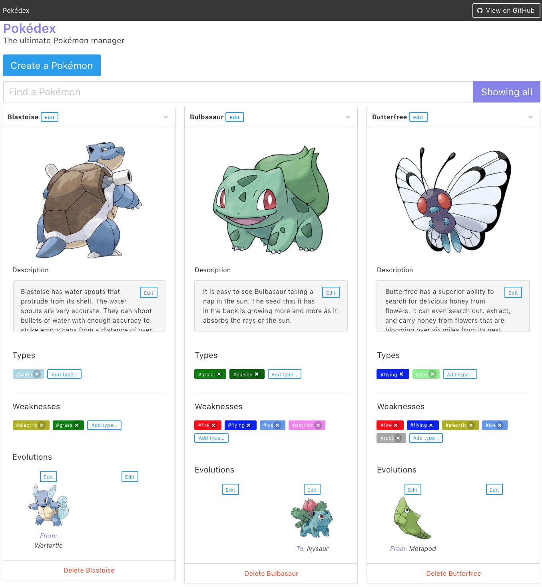

# Pokedex
The little Alejandro Infantes Herrera (fictitious name) is a Vicata of Pokémon. It has gone from the old and mono version of Game Boy to the Pokémon Go. He no longer knows what to do, and has decided to make his own Pokédex.

# Prerequisites

[Node.js](https://nodejs.org/en/download/) > 8.11.* 

[MongoDB](https://www.mongodb.com/download-center#community) 3.6.*

# Installation

First clone this repository:

`git clone https://github.com/wdmtech/pokedex`

## Running with Docker

`docker-compose up`

## Running locally

to start the client: 

`cd client`
`npm run dev`

to start the server:

`cd server`
`npm run start`

# Possible improvements following MVP

- Add notifications and messages for adding/deleting properties
- Validate inputs

